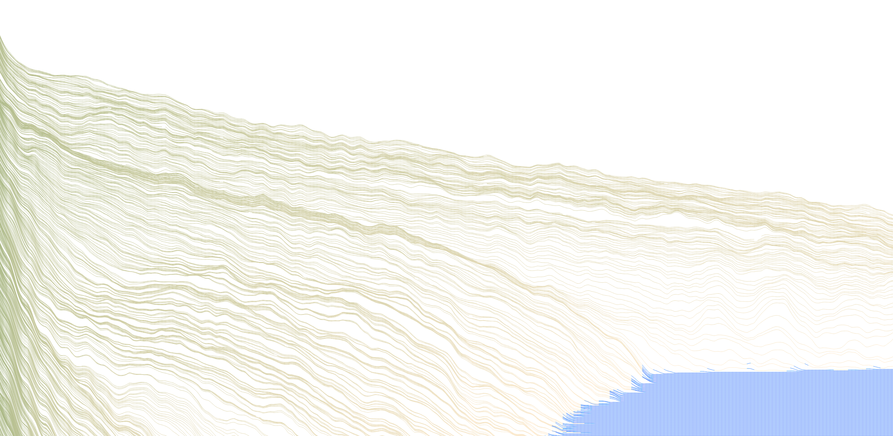

# Musical Landscape
[Project Website](https://jtbon20.github.io/MusicalLandscape/)

## Project Overview

### Motivation
This musical visualizer uses an FFT of the waveform to audio to generate a 3D landscape that is colored to appear like a topographical map.

We worked to create a visual music project and created both the visual and audio

### Next features
* Use the file-system to select `.mp3` to play
* Use mic-input to drive the landscape

## Setup
### Global installs
Git clone this repo locally.

### Environment setup
Be sure to run `yarn` to install all dependencies.

`python3 -m http.server` in the main folder serves the project locally to be viewed at [`http://localhost:8000/`](http://localhost:8000/).

## Authors

* Taggart Bonham
* Trevor Briggs

## Acknowledgments

* [Dr. Richard Beaudoin](http://www.richardbeaudoin.com/)
* [Jason Sigal](http://www.jasonsigal.cc/)
* [p5](https://p5js.org/) for processing and drawing
